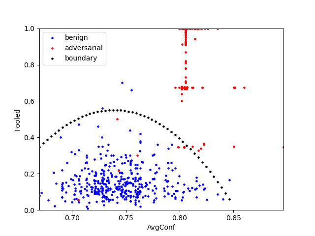

# Backdoor attacks and defense

This repo is aimed to build a library containing codes of popular backdoor attacks and defenese. 
The main goal is to make the implementation simple and easy-to-use, meanwhile without learning how the code is writing.

Current codes containing:

- Defense: [SentiNet: Detecting Localized Universal Attacks Against Deep Learning Systems](https://arxiv.org/abs/1812.00292). I cannot found an official implementation.
- More attacks and defense: coming...

# Logs

- 2023/3/22: Add defense, SentiNet.

# Usage

## Defense

### SentiNet

How is an example: 
```python
import torch, os
from timm import create_model
from existing import SentiNet
from logging import DEBUG, INFO, Logger
from torchvision.transforms import Resize, Normalize

logger = define_your_logger_here # Logger from module logging

# * load model
model: torch.nn.Module = get_your_pytorch_model_here
model.load_state_dict(torch.load(your_checkpoint_path))
layer = the_layer_of_your_pytorch_model # e.g., for resnet18, it can be: layer = model.layer4[1].conv2

# * load imgs
benign_imgs = your_benign_image_paths # It looks like ['path/to/image1.png', 'path/to/image2.png', ...]
test_imgs = your_test_image_paths
adv_imgs = your_adv_image_paths

# * run sentinet
normalize = Normalize(the_mean_your_model_required, the_std_your_model_required) # e.g., [0.485, 0.456, 0.406], [0.229, 0.224, 0.225]
resize = Resize(the_input_size_your_model_required)
transform = lambda x: normalize(resize(x))
sentinet = SentiNet(
    model, layer, the_input_size_your_model_required, transform, 
    benign_imgs, test_imgs, adv_imgs, 
    log_path='logs/sentinet', logger=logger)

sentinet.detect()
```

The ***sentinet.detect()*** method will output 3 files (see *samples/sentinet*) and 2 files containing the results: *sentinet-results.json* and *sentinet-results.png*. 
The *sentinet-results.json* containing all detailed results such as the curve function weights, training/testing points. 
The *sentinet-results.png* plots the curve and benign/adv points. It looks like the following example (running for the badnets attack.):



